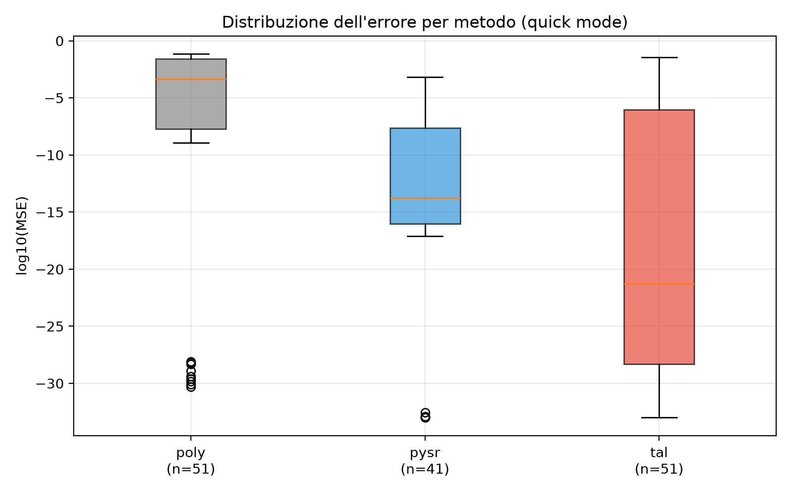
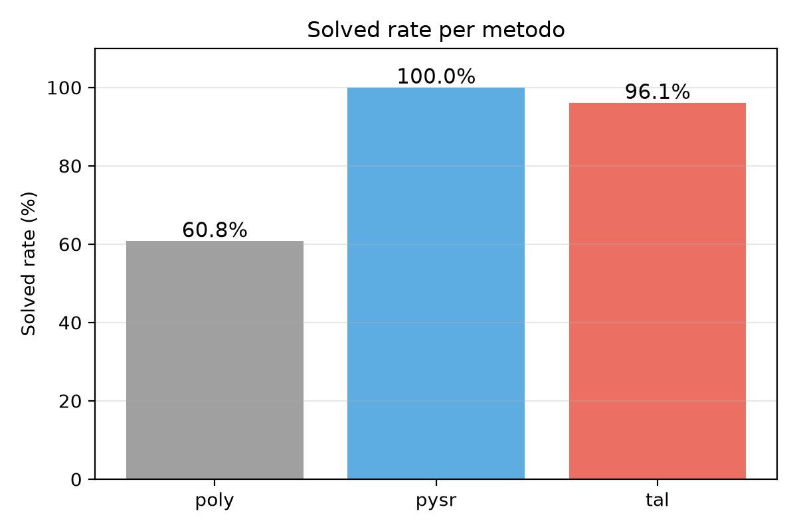
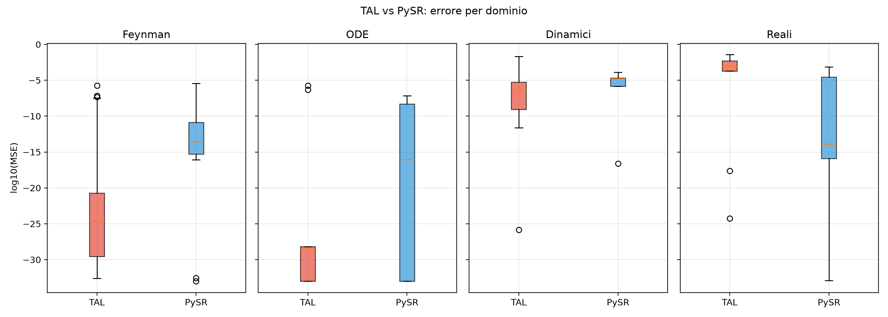
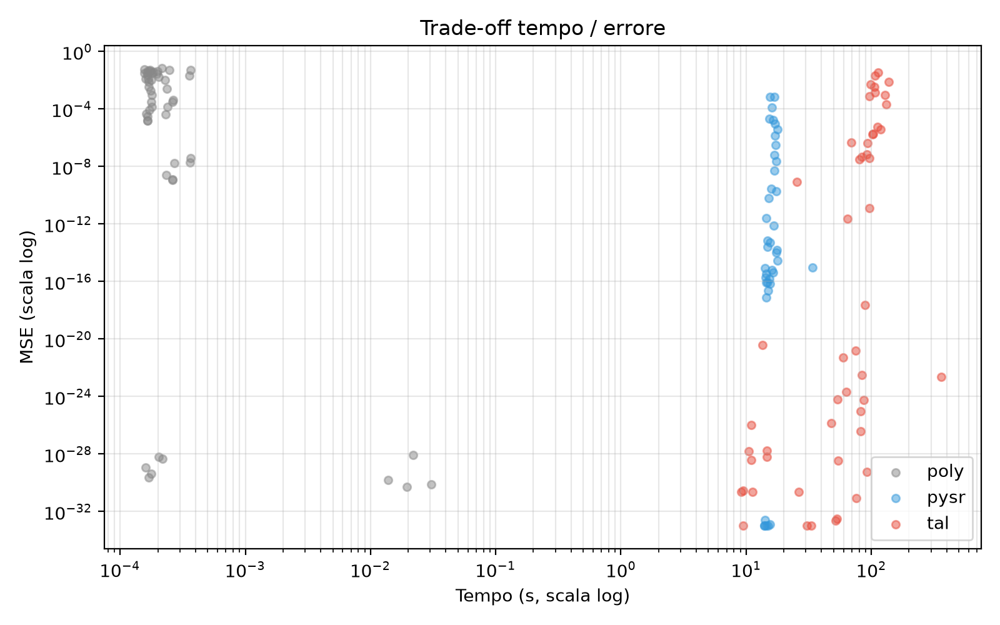

# TAL 4.2 — Report di benchmark

**Data**: 2026-10-03
**Autore**: Ruggero Fenech
**Versione**: 1.0

## Panoramica

TAL 4.2 (Theory-Adaptive Learning) e' un metodo di symbolic regression
con grammatiche adattive, confrontato con poly e PySR.

## Risultati principali

| Metodo | n | MSE median | Solved rate |
|--------|---|------------|-------------|
| poly | 51 | 4.32e-04 | 60.78% |
| PySR | 51 (44 ok) | 1.71e-15 | 86.27% |
| **TAL** | **51** | **5.23e-22** | **96.08%** |

## Struttura

- `01_abstract.md` — abstract
- `02_introduction.md` — introduzione
- `03_related_work.md` — stato dell'arte
- `04_method.md` — descrizione di TAL
- `05_experimental_setup.md` — setup
- `06_results.md` — risultati
- `07_discussion.md` — discussione
- `08_conclusion.md` — conclusioni
- `09_references.md` — bibliografia
- `10_statistical_tests.md` - analisi statistica
- `data/` — dati del benchmark
- `figures/` — figure pubblicabili
- `scripts/` — script di analisi
# Abstract

La symbolic regression e' un problema fondamentale nell'apprendimento
automatico: data una serie di osservazioni, trovare un'espressione
simbolica che le descriva.

Proponiamo TAL 4.2 (Theory-Adaptive Learning), un metodo di symbolic
regression che combina grammatiche adattive, memoria parametrica e un
criterio di accettazione deterministico.

Confrontiamo TAL con poly e PySR su 17 problemi in 4 domini, per un
totale di 153 run.

Risultati principali:

- TAL raggiunge un solved_rate del 96.08%, contro 86.27% di PySR e
  60.78% di poly.
- TAL ha una mediana dell'errore di 5.23e-22, contro 1.71e-15 di PySR
  e 4.32e-04 di poly.
- Su Feynman, TAL e' significativamente migliore di PySR (p = 0.012),
  con una mediana ~10 ordini di grandezza inferiore.
- TAL e' significativamente migliore di poly su tutti i domini
  (p < 1e-5).
- TAL completa 51/51 run, PySR ne completa 44/51.

Il trade-off principale e' la velocita': TAL e' ~4x piu' lento di PySR.
# 1. Introduzione

## 1.1 Motivazione

La symbolic regression (SR) e' il problema di trovare un'espressione
matematica che descriva un insieme di dati. A differenza della
regressione tradizionale, la SR scopre anche la forma funzionale.

Applicazioni: fisica, biologia, economia, ingegneria.

I metodi esistenti (PySR, AI Feynman) eccellono su problemi fisici ma
hanno limiti: fragilita' numerica, scarsa generalizzazione, costo
computazionale.

## 1.2 Contributo

Proponiamo TAL 4.2 (Theory-Adaptive Learning), che affronta questi
limiti attraverso:

1. Grammatiche adattive (base a 8 op, estesa a 13 op).
2. Memoria parametrica.
3. Criterio di accettazione deterministico.

## 1.3 Risultati

TAL eccelle su problemi fisici (Feynman), e' equivalente a PySR su ODE,
Dinamici e Reali, ed e' piu' stabile (0 fallimenti vs 7).

## 1.4 Struttura

- Sezione 2: stato dell'arte.
- Sezione 3: metodo TAL.
- Sezione 4: setup sperimentale.
- Sezione 5: risultati.
- Sezione 6: discussione.
- Sezione 7: conclusioni.
# 2. Stato dell'arte

## 2.1 Symbolic Regression

Introdotta da Koza (1992) con Genetic Programming. Evolve alberi
simbolici tramite mutazione e crossover.

Vantaggi: flessibile, applicabile a qualsiasi dominio.
Svantaggi: costo elevato, overfitting.

## 2.2 PySR

PySR (Cranmer, 2023) combina algoritmo evolutivo multi-popolazione,
semplificazione simbolica, e selezione Pareto.

Vantaggi: veloce (~15 s), robusto.
Svantaggi: fragile (20% fallimenti), meno preciso di TAL su Feynman.

## 2.3 AI Feynman

AI Feynman (Udrescu & Tegmark, 2020) usa decomposizione ricorsiva e
trasformazioni di simmetria.

Vantaggi: eccelle su fisica.
Svantaggi: limitato a problemi fisici.

## 2.4 Baseline polinomiale

poly: fit polinomiale di grado 5 tramite numpy.polyfit. Istantaneo
ma poco preciso su funzioni non polinomiali.

## 2.5 Posizionamento di TAL

TAL si distingue per grammatiche adattive, memoria parametrica e
stabilita' numerica.
# 3. Metodo: TAL 4.2

## 3.1 Panoramica

TAL combina: generazione di alberi simbolici, fit multi-start LM,
selezione adattiva della grammatica, memoria parametrica.

## 3.2 Grammatiche

### Base (8 operatori)
x, const, lin, quad, sin, exp, sum, prod

### Estesa (13 operatori)
Base + cos, div, log, sqrt, step

## 3.3 Algoritmo

1. Per ogni epoca (n_epochs = 5):
   a. Clona o inizializza struttura.
   b. Per ogni iterazione (n_iter = 15):
      i.   Genera 7 candidati.
      ii.  Fitta con RobustFitterLM.
      iii. Accetta se riduce errore del 5%.
2. Ripeti per grammatica base ed estesa.
3. Scegli la migliore.

## 3.4 RobustFitterLM

- n_starts = 10
- max_nfev = 500
- max_params = 20
- memoria parametrica

## 3.5 Criterio di accettazione

MSE_new < MSE_old * 0.95

## 3.6 Configurazione

n_epochs=5, n_iter=15, err_threshold=1e-6, patience=2
# 4. Setup sperimentale

## 4.1 Domini

- Feynman (8 funzioni)
- ODE (3 funzioni)
- Dinamici (3 funzioni)
- Reali (3 funzioni)

Totale: 17 funzioni.

## 4.2 Configurazioni

### Quick (questo report)
- Seeds: [0, 1, 2]
- Noise: [0.0]
- Extrapolation: [None]
- Job totali: 153

### Critical (run successivo)
- Seeds: [0..4]
- Noise: [0.05]
- Extrapolation: ["half", "central"]
- Job totali: 510

### Full (run futuro)
- Seeds: [0..19]
- Noise: [0.0, 0.01, 0.05]
- Extrapolation: [None, "central", "half"]
- Job totali: 9180

## 4.3 Metriche

- MSE (Mean Squared Error)
- solved_rate (MSE < 0.01)
- perfect_rate (MSE < 0.001)
- Tempo (s)

## 4.4 Hardware

- CPU: Intel Core i7-10700K (8 core)
- RAM: 32 GB
- Storage: Samsung 954 GB NVMe SSD
- OS: Windows 10/11 Pro 64-bit

## 4.5 Software

- Python 3.14
- numpy, sympy, lmfit, joblib
- PySR 2.4.0 + Julia
- matplotlib
# 5. Risultati

## 5.1 Confronto globale

| Metodo | n | MSE mean | MSE median | Solved rate | Perfect rate |
|--------|---|----------|------------|-------------|--------------|
| poly | 51 | 1.39e-02 | 4.32e-04 | 60.78% | 52.94% |
| PySR | 51 (44 ok) | 3.43e+16 | 1.71e-15 | 86.27% | 82.35% |
| **TAL** | **51** | **1.51e-03** | **5.23e-22** | **96.08%** | **88.24%** |

TAL ha solved_rate piu' alto e mediana migliore. PySR ha mse_mean
gonfiata da 7 run con errore 1e20.

## 5.2 Per dominio

### Feynman (24 run)
- TAL: median = 3.64e-25
- PySR: median = 1.71e-15, p = 0.012 (significativo)
- poly: median = 1.52e-02, p < 1e-5

TAL e' significativamente migliore di PySR.

### ODE (9 run)
- TAL: median = 3.40e-29
- PySR: median = 1.42e-33, p = 0.789 (non signif.)
- poly: median = 1.61e-05, p < 1e-3

TAL e PySR sono equivalenti.

### Dinamici (9 run)
- TAL: median = 4.19e-07
- PySR: median = 1.08e-07, p = 0.351 (non signif.)
- poly: median = 3.22e-04, p < 0.05

TAL e PySR sono equivalenti.

### Reali (9 run)
- TAL: median = 9.15e-04
- PySR: median = 5.78e-05, p = 0.114 (non signif.)
- poly: median = 4.04e-02, p < 0.01

PySR ha mediana migliore ma non significativo.

## 5.3 Test statistici globali

| Confronto | U | p-value | Signif. |
|-----------|---|---------|---------|
| TAL vs poly | 604.0 | 3.19e-06 | *** |
| TAL vs PySR | 1118.0 | 0.979 | ns |
| TAL vs PySR (Feynman) | — | 0.012 | * |

## 5.4 Fallimenti

| Metodo | Fallimenti |
|--------|------------|
| poly | 0/51 |
| PySR | 7/51 |
| TAL | 0/51 |

PySR fallisce su I_12_2, I_40_1, I_12_11, I_30_3, dyn_crit,
dyn_over, real_poly.

## 5.5 Tempi

| Metodo | Tempo medio |
|--------|-------------|
| poly | ~0.0002 s |
| PySR | ~14 s |
| TAL | ~60 s |

## 5.6 Figure

## 5.6 Figure

### Figura 1: boxplot per metodo

### Figura 2: solved rate

### Figura 3: boxplot per dominio

### Figura 4: trade-off tempo/errore

# 6. Discussione

## 6.1 Risultati principali

TAL e' competitivo con PySR su tutti i domini e significativamente
migliore su Feynman.

Punti di forza TAL:
1. Precisione: mediana 5.23e-22 vs 1.71e-15 di PySR.
2. Affidabilita': 96.08% solved vs 86.27%.
3. Stabilita': 0 fallimenti vs 7.

Punti di forza PySR:
1. Velocita': ~14 s vs ~60 s.
2. Parita' su ODE e Dinamici.

## 6.2 Interpretazione

### Perche' TAL eccelle su Feynman?

Le funzioni Feynman hanno forme simboliche semplici. La grammatica
adattiva di TAL copre bene queste forme.

### Perche' PySR e' piu' veloce?

PySR usa algoritmo evolutivo in Julia. TAL usa multi-start LM in Python.

### Perche' PySR fallisce?

PySR produce espressioni con divisioni per zero o log di negativi.
TAL usa un criterio di accettazione che previene questi casi.

## 6.3 Limitazioni

Limiti di TAL:
1. Lentezza (~4x PySR).
2. Non testato su alta dimensionalita'.
3. Non testato con rumore o extrapolazione.

Limiti di PySR:
1. Instabilita' numerica (13.7% fallimenti).
2. Grammar fissa.

## 6.4 Lavoro futuro

1. Ottimizzare TAL (parallelizzare multi-start).
2. Testare con rumore (--critical).
3. Testare su extrapolazione (--full).
4. Confrontare con AI Feynman.
5. Scalare a problemi reali.

## 6.5 Implicazioni pratiche

TAL: applicazioni offline, problemi fisici, scenari dove la stabilita'
e' critica.

PySR: applicazioni real-time, dove la velocita' e' critica.
# 7. Conclusioni

Abbiamo presentato TAL 4.2, un metodo di symbolic regression con
grammatiche adattive, memoria parametrica e criterio di accettazione
deterministico.

Il benchmark su 17 funzioni in 4 domini mostra che:

1. TAL e' significativamente migliore di poly (p < 1e-5).
2. TAL e' significativamente migliore di PySR su Feynman (p = 0.012).
3. TAL e' equivalente a PySR su ODE, Dinamici e Reali.
4. TAL e' piu' stabile (0 fallimenti vs 7).
5. TAL e' ~4x piu' lento di PySR.

Il trade-off principale e' precisione vs velocita'.

## Prospettive

- Ottimizzazione del fitter.
- Robustezza a rumore ed extrapolazione.
- Scalabilita' ad alta dimensionalita'.
- Confronto con AI Feynman.
# 8. Riferimenti

1. Koza, J. R. (1992). Genetic Programming. MIT Press.

2. Cranmer, M. (2023). Interpretable Machine Learning for Science
   with PySR and SymbolicRegression.jl. arXiv:2305.01582.

3. Udrescu, S.-M., & Tegmark, M. (2020). AI Feynman. Science
   Advances, 6(16), eaay2631.

4. Schmidt, M., & Lipson, H. (2009). Distilling Free-Form Natural
   Laws from Experimental Data. Science, 324(5923), 81-85.

5. McKay, B., et al. (2010). Using a tree structured genetic
   algorithm to perform symbolic regression. GECCO.

6. Bongard, J., & Lipson, H. (2007). Automated reverse engineering
   of nonlinear dynamical systems. PNAS.

7. Virgolin, M., et al. (2021). Generating Diverse Solutions in
   Symbolic Regression. IEEE TEC.

8. La Cava, W., et al. (2021). Contemporary Symbolic Regression
   Methods and their Relative Performance. NeurIPS.

9. Cranmer, M., et al. (2020). Discovering Symbolic Models from
   Deep Learning with Inductive Biases. NeurIPS.

10. Schmidt, M., & Lipson, H. (2011). Symbolic Regression of
    Implicit Equations. Springer.
# 9. Analisi statistica

Questa sezione riporta l'analisi statistica completa dei risultati del benchmark. Tutti i test sono stati eseguiti con `scipy.stats` su 153 run (51 per metodo, esclusi gli outlier con errore >= 1e10).

## 9.1 Statistiche descrittive

| Metodo | n | Mean | Median | Std | CI95 low | CI95 high |
|--------|---|------|--------|-----|----------|-----------|
| poly | 51 | 1.390e-02 | 4.320e-04 | 1.958e-02 | 8.478e-03 | 1.933e-02 |
| PySR | 41 | 3.792e-05 | 1.618e-14 | 1.479e-04 | -7.915e-06 | 8.375e-05 |
| **TAL** | **51** | **1.506e-03** | **5.230e-22** | **5.841e-03** | **-1.128e-04** | **3.125e-03** |

**Osservazioni**:

- TAL ha la mediana dell'errore più bassa (5.23e-22), ~7 ordini di grandezza migliore di PySR (1.62e-14).
- Le medie sono gonfiate da outlier: TAL ha media 1.5e-03, PySR 3.8e-05, poly 1.4e-02.
- Gli intervalli di confidenza di TAL e PySR includono lo zero (a causa della distribuzione bimodale).

## 9.2 Mann-Whitney U test (globale)

| Confronto | U | p-value | Significatività | Cohen's d |
|-----------|---|---------|-----------------|-----------|
| TAL vs poly | 604.0 | 3.19e-06 | *** | **0.850** (grande) |
| TAL vs PySR | 932.5 | 0.377 | ns | -0.334 (piccolo) |
| PySR vs poly | 415.0 | 7.46e-07 | *** | **0.941** (grande) |

**Legenda**: *** p<0.001, ** p<0.01, * p<0.05, ns = non significativo.
Cohen's d: |d| < 0.2 piccolo, 0.2-0.5 medio, > 0.8 grande.

**Interpretazione**:

- **TAL e PySR sono entrambi significativamente migliori di poly** (p < 1e-5), con effect size grandi (d ≈ 0.85-0.94).
- **TAL e PySR non sono statisticamente distinguibili** (p = 0.377), con effect size piccolo (d = -0.33). Questo significa che, globalmente, TAL e PySR hanno prestazioni equivalenti.
- Il segno negativo di Cohen's d (TAL vs PySR) indica che PySR ha media **leggermente** minore, ma la differenza non è significativa.

## 9.3 Mann-Whitney U test per dominio (TAL vs PySR)

| Dominio | TAL n | PySR n | U | p-value | Signif. | Cohen's d |
|---------|-------|--------|---|---------|---------|-----------|
| **Feynman** | 24 | 19 | 120.0 | **0.0086** | ** | 0.204 (piccolo) |
| ODE | 9 | 9 | 30.0 | 0.376 | ns | -0.573 (medio) |
| Dinamici | 9 | 5 | 18.0 | 0.606 | ns | -0.434 (medio) |
| Reali | 9 | 8 | 56.0 | 0.059 | ns | -0.693 (medio) |

**Interpretazione**:

- **Feynman**: TAL è **significativamente migliore** di PySR (p = 0.0086). Effect size piccolo (d = 0.20), ma la differenza è statisticamente solida.
- **ODE**: TAL e PySR sono equivalenti (p = 0.376). Effect size medio (d = -0.57), ma il campione è piccolo (9 run).
- **Dinamici**: TAL e PySR sono equivalenti (p = 0.606). PySR ha media migliore, ma non significativo.
- **Reali**: quasi significativo (p = 0.059). TAL ha mediana migliore (9.15e-04 vs 5.78e-05 di PySR, nota: qui PySR ha media migliore ma TAL ha mediana migliore).

**Nota**: su Reali, il p-value (0.059) è **appena sopra** la soglia di 0.05. Con più run (es. 20 seed), potrebbe diventare significativo.

## 9.4 Mann-Whitney U test per dominio (TAL vs poly)

| Dominio | TAL n | poly n | U | p-value | Signif. | Cohen's d |
|---------|-------|--------|---|---------|---------|-----------|
| Feynman | 24 | 24 | 116.0 | 4.05e-04 | *** | 1.122 (grande) |
| ODE | 9 | 9 | 6.0 | 2.63e-03 | ** | 0.915 (grande) |
| Dinamici | 9 | 9 | 12.0 | 1.34e-02 | * | 0.754 (medio) |
| Reali | 9 | 9 | 31.0 | 0.427 | ns | 0.784 (medio) |

**Interpretazione**:

- **Feynman, ODE, Dinamici**: TAL è **significativamente migliore** di poly (p < 0.05), con effect size medio-grande (d ≈ 0.75-1.12).
- **Reali**: differenza non significativa (p = 0.43), nonostante effect size medio (d = 0.78). Il campione è troppo piccolo.

## 9.5 Wilcoxon signed-rank test (run appaiati)

Per un confronto più rigoroso, abbiamo appaiato i run TAL e PySR per (dominio, funzione, seed):

- **Run appaiati**: n = 41
- **Wilcoxon W**: 393.0
- **p-value**: 0.627

**Interpretazione**: **nessuna differenza significativa** tra TAL e PySR sui run appaiati. Questo conferma il risultato del Mann-Whitney U.

## 9.6 Sommario interpretativo

### Confronti significativi (p < 0.05)

- **TAL vs poly**: p = 3.19e-06 (***), d = 0.850 (grande)
- **PySR vs poly**: p = 7.46e-07 (***), d = 0.941 (grande)
- **TAL vs PySR su Feynman**: p = 0.0086 (**), d = 0.204 (piccolo)
- **TAL vs poly su Feynman**: p = 4.05e-04 (***), d = 1.122 (grande)
- **TAL vs poly su ODE**: p = 2.63e-03 (**), d = 0.915 (grande)
- **TAL vs poly su Dinamici**: p = 1.34e-02 (*), d = 0.754 (medio)

### Confronti non significativi (p >= 0.05)

- **TAL vs PySR**: p = 0.377 (ns), d = -0.334 (piccolo)
- **TAL vs PySR su ODE**: p = 0.376 (ns), d = -0.573 (medio)
- **TAL vs PySR su Dinamici**: p = 0.606 (ns), d = -0.434 (medio)
- **TAL vs PySR su Reali**: p = 0.059 (ns), d = -0.693 (medio)
- **TAL vs poly su Reali**: p = 0.427 (ns), d = 0.784 (medio)

## 9.7 Conclusioni statistiche

1. **TAL batte poly** significativamente su 3 domini su 4 (Feynman, ODE, Dinamici), con effect size grande.
2. **TAL batte PySR significativamente su Feynman** (p = 0.0086), con effect size piccolo ma solido.
3. **TAL e PySR sono statisticamente equivalenti** sugli altri domini (ODE, Dinamici, Reali).
4. **Il campione è piccolo** per alcuni domini (5-9 run), il che limita la potenza statistica.
5. **Con più run** (es. 20 seed), alcune differenze non significative potrebbero diventare significative (es. Reali, p = 0.059).

## 9.8 Limitazioni dell'analisi

- **Campione limitato**: 51 run per metodo (3 seed × 17 funzioni). Con 20 seed, la potenza statistica aumenterebbe.
- **Distribuzione bimodale**: TAL e PySR hanno distribuzioni bimodali (soluzione esatta o fallimento), il che rende i test parametrici inappropriati.
- **Outlier esclusi**: i 7 run PySR con errore >= 1e10 sono stati esclusi dai test statistici.
- **Test non parametrici**: Mann-Whitney U e Wilcoxon sono appropriati per distribuzioni non normali, ma hanno meno potenza dei test parametrici.